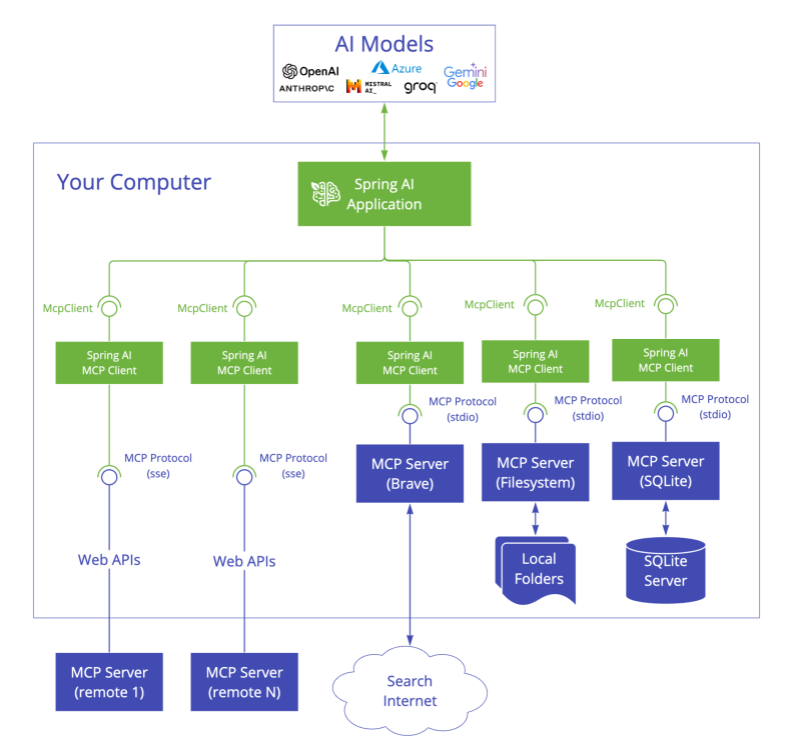

# Java & Spring MCP

Set of projects that provide Java SDK and Spring Framework integration for the [Model Context Protocol](https://modelcontextprotocol.org/docs/concepts/architecture). 
It enables Java applications to interact with AI models and tools through a standardized interface, supporting both synchronous and asynchronous communication patterns.



## Projects

### [MCP Java SDK](https://docs.spring.io/spring-ai-mcp/reference/mcp.html)

Java implementation of the Model Context Protocol specification. It includes:
- Synchronous and asynchronous [MCP Client](https://github.com/spring-projects-experimental/spring-ai-mcp/blob/main/mcp/README.md#client-usage-examples) and [MCP Server](https://github.com/spring-projects-experimental/spring-ai-mcp/blob/main/mcp/README.md#server-usage-examples) implementations
- Standard MCP operations support (tool discovery, resource management, prompt handling, structured logging). Support for request and notification handling.
- [Stdio](https://spec.modelcontextprotocol.io/specification/basic/transports/#stdio) and [SSE](https://spec.modelcontextprotocol.io/specification/basic/transports/#http-with-sse) transport implementations. 

### MCP Transports

#### Core Transports
- Stdio-based (`StdioClientTransport`, `StdioServerTransport`) for process-based communication
- Java HttpClient-based SSE client (`HttpClientSseClientTransport`) for HTTP streaming

#### Optional SSE Transports
- [WebFlux SSE Transport](https://github.com/spring-projects-experimental/spring-ai-mcp/tree/main/mcp-transport/mcp-webflux-sse-transport) - Reactive HTTP streaming with Spring WebFlux (Client & Server)
- [WebMvc SSE Transport](https://github.com/spring-projects-experimental/spring-ai-mcp/tree/main/mcp-transport/mcp-webmvc-sse-transport) - Servlet-based HTTP streaming (Server only). 
Use the core `HttpClientSseClientTransport` for SSE clients.

### [Spring AI MCP](https://docs.spring.io/spring-ai-mcp/reference/spring-mcp.html)

The Spring integration module provides Spring-specific functionality:
- Integration with Spring AI's function calling system
- Spring-friendly abstractions for MCP clients
- Auto-configurations (WIP)


## Installation

Add the following dependencies to your Maven project:

```xml
<!-- Core MCP -->
<dependency>
    <groupId>org.springframework.experimental</groupId>
    <artifactId>mcp</artifactId>
    <version>0.5.0-SNAPSHOT</version>
</dependency>

<!-- Optional: WebFlux SSE transport -->
<dependency>
    <groupId>org.springframework.experimental</groupId>
    <artifactId>mcp-webflux-sse-transport</artifactId>
    <version>0.5.0-SNAPSHOT</version>
</dependency>

<!-- Optional: WebMVC SSE transport -->
<dependency>
    <groupId>org.springframework.experimental</groupId>
    <artifactId>mcp-webmvc-sse-transport</artifactId>
    <version>0.5.0-SNAPSHOT</version>
</dependency>

<!-- Optional: Spring AI integration -->
<dependency>
    <groupId>org.springframework.experimental</groupId>
    <artifactId>spring-ai-mcp</artifactId>
    <version>0.5.0-SNAPSHOT</version>
</dependency>
```

This is a milestone release, not available on Maven Central. 
Add this repository to your POM:

```xml
<repositories>
    <repository>
        <id>spring-milestones</id>
        <name>Spring Milestones</name>
        <url>https://repo.spring.io/milestone</url>
        <snapshots>
            <enabled>false</enabled>
        </snapshots>
    </repository>
</repositories>
```


## Example Demos

Explore these MCP examples in the [spring-ai-examples/model-context-protocol](https://github.com/spring-projects/spring-ai-examples/tree/main/model-context-protocol) repository:

- [SQLite Simple](https://github.com/spring-projects/spring-ai-examples/tree/main/model-context-protocol/sqlite/simple) - Demonstrates LLM integration with a database
- [SQLite Chatbot](https://github.com/spring-projects/spring-ai-examples/tree/main/model-context-protocol/sqlite/chatbot) - Interactive chatbot with SQLite database interaction
- [Filesystem](https://github.com/spring-projects/spring-ai-examples/tree/main/model-context-protocol/filesystem) - Enables LLM interaction with local filesystem folders and files
- [Brave](https://github.com/spring-projects/spring-ai-examples/tree/main/model-context-protocol/brave) - Enables natural language interactions with Brave Search, allowing you to perform internet searches.
- [Theme Park API Example](https://github.com/habuma/spring-ai-examples/tree/main/spring-ai-mcp) - Shows how to create an MCP server and client with Spring AI, exposing Theme Park API tools
- [Http SSE Client + WebMvc SSE Server sample](https://github.com/spring-projects/spring-ai-examples/tree/main/model-context-protocol/mcp-webmvc-server) - Showcases how to create and use MCP WebMvc servers and HttpClient clients with different capabilities.
* [WebFlux SSE Client + WebFlux SSE Server sample](https://github.com/spring-projects/spring-ai-examples/tree/main/model-context-protocol/mcp-webflux-server) - Showcases how to create and use MCP WebFlux servers and clients with different capabilities


## Documentation

- [Java MCP SDK documentation](mcp/README.md)
  - [Reference documentation](docs/ref-index.md)
- [Spring Integration documentation](spring-ai-mcp/README.md)


## Development

- Building from Source

```bash
mvn clean install
```

- Running Tests

```bash
mvn test
```


## Contributing

This is an experimental Spring project. Contributions are welcome! Please:

1. Fork the repository
2. Create a feature branch
3. Submit a Pull Request

## Team

- Christian Tzolov
- Dariusz Jędrzejczyk

## Links

- [GitHub Repository](https://github.com/spring-projects-experimental/spring-ai-mcp)
- [Issue Tracker](https://github.com/spring-projects-experimental/spring-ai-mcp/issues)
- [CI/CD](https://github.com/spring-projects-experimental/spring-ai-mcp/actions)

## License

This project is licensed under the [Apache License 2.0](LICENSE).
