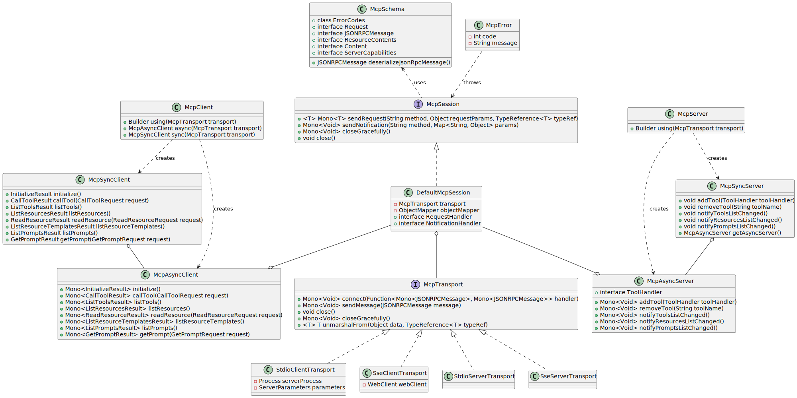

# Model Context Protocol (MCP) Java SDK

A Java implementation of the [Model Context Protocol](https://modelcontextprotocol.org/docs/concepts/architecture) specification, providing both synchronous and asynchronous clients for MCP server interactions.

## Overview

This SDK implements the Model Context Protocol, enabling seamless integration with AI models and tools through a standardized interface. It supports both synchronous and asynchronous communication patterns, making it suitable for various use cases and integration scenarios.

## Features

- Synchronous and Asynchronous MCP Client and MCP Server implementations
- Standard MCP operations support:
  - Protocol version compatibility negotiation
  - Tool discovery and execution with change notifications
  - Tool list change notifications with non-blocking consumer support
  - Resource management with URI templates
  - Resource subscription system
  - Roots list management and notifications
  - Prompt handling and management
- Multiple transport implementations:
  - Stdio-based transport for process-based communication
  - SSE-based transport for HTTP streaming
- Configurable request timeouts

## Installation

Add the following dependency to your Maven project:

```xml
<dependency>
    <groupId>org.springframework.experimental</groupId>
    <artifactId>mcp</artifactId>
    <version>0.3.0-SNAPSHOT</version>
</dependency>
```

## Architecture

The SDK follows a layered architecture with clear separation of concerns:

### Core Components Hierarchy


- **Transport Layer (McpTransport)**: Handles JSON-RPC message serialization/deserialization via StdioTransport (stdin/stdout) and SseTransport (HTTP streaming).
- **Session Layer (McpSession)**: Manages communication patterns and state using DefaultMcpSession implementation.
- **Client/Server Layer**: Both use McpSession for sync/async operations, with McpClient handling client-side protocol operations and McpServer managing server-side protocol operations.

Following class diagram illustrates the layered architecture of the MCP SDK, showing the relationships between core interfaces (McpTransport, McpSession), their implementations, and the client/server components. It highlights how the transport layer connects to sessions, which in turn support both synchronous and asynchronous client/server implementations.




### Key Interactions

- **Client/Server Initialization**: Transport setup, protocol compatibility check, capability negotiation, and implementation details exchange.
- **Message Flow**: JSON-RPC message handling with validation, type-safe response processing, and error handling.
- **Resource Management**: Resource discovery, URI template-based access, subscription system, and content retrieval.
- **Prompt System**: Discovery, parameter-based retrieval, change notifications, and content management.
- **Tool Execution**: Discovery, parameter validation, timeout-aware execution, and result processing.


### [Reference Documentation](../docs/ref-index.md) 
Detailed reference documentation covering the Spring AI implementation of the Model Context Protocol (MCP) specification.


## Quick Start

### McpClient 

Factory for creating `sync` and `async` variants MCP clients. Uses McpSession for communication and handles client-side protocol operations. 

#### Sync MCP Client

```java
// Create and initialize sync client
McpTransport mcpTransport = ...

try (McpSyncClient client = McpClient.using(mcpTransport).sync()) {
    // Initialize connection with protocol version and capabilities
    InitializeResult initResult = client.initialize();

    // List available tools
    ListToolsResult tools = client.listTools();

    // Execute a tool
    CallToolResult result = client.callTool(
        new CallToolRequest("echo", Map.of("message", "Hello!"))
    );

    // Resource management
    ListResourcesResult resources = client.listResources();
    ReadResourceResult resource = client.readResource(
        new ReadResourceRequest("resource-uri")
    );

    // List and retrieve prompts
    ListPromptsResult prompts = client.listPrompts();
    GetPromptResult prompt = client.getPrompt(
        new GetPromptRequest("prompt-id", Map.of())
    );
}
```

#### Async MCP Client

```java
McpTransport mcpTransport = ...

// Initialize async client with custom timeout
McpAsyncClient client = McpClient.using(mcpTransport)
    .requestTimeout(Duration.ofSeconds(30))
    .async();

// Initialize connection and chain operations
var result = client.initialize()
    // Connection initialized with protocol version compatibility
    .flatMap(initResult -> client.listTools())
    // Process available tools    
    .flatMap(tools ->  client.callTool(
        new CallToolRequest("echo", Map.of("message", "Hello MCP!"))))
    // Handle tool execution result            
    .flatMap(toolResult -> client.listPrompts())
    // Process available prompts
    .flatMap(prompts -> client.getPrompt(new GetPromptRequest("prompt-id", Map.of()));

// Subscribe to resource changes
var subscription = client.listResources()
    .flatMap(resources -> client.subscribeResource(new SubscribeRequest("resource-uri")));

// Handle results reactively or block if needed
GetPromptResult promptResult = result.block();
subscription.block();

// Cleanup
client.closeGracefully().block();
```

#### Client Transports
Clients can use the following transport options:

##### StdioClientTransport
Standard I/O based transport for process-based communication with MCP servers:

```java
ServerParameters params = ServerParameters.builder("npx")
    .args("-y", "@modelcontextprotocol/server-everything", "dir")
    .build();
McpTransport transport = new StdioClientTransport(params);
```

##### SseClientTransport
Server-Sent Events (SSE) based transport following the MCP HTTP with SSE transport specification:

```java
WebClient.Builder webClientBuilder = WebClient.builder()
    .baseUrl("http://your-mcp-server");
McpTransport transport = new SseClientTransport(webClientBuilder);
```


### MCP Server 

Factory for creating `sync` and `async` variants MCP servers. Uses McpSession for communication and handles server-side protocol operations. 

#### MCP Sync Server

```java
// Create a sync server with custom configuration
McpSyncServer syncServer = McpServer.using(transport)
    .serverInfo("my-server", "1.0.0")
    .serverCapabilities(new ServerCapabilities(...))
    .addTool(new CalculatorTool())
    .resourcesProvider(cursor -> resources)
    .promptsProvider(cursor -> prompts)
    .sync();

// Add a tool handler at runtime
syncServer.addTool(new CalculatorTool());
logger.info("Tool added");

// Remove a tool handler
syncServer.removeTool("calculator");
logger.info("Tool removed");

// Notify clients of changes
syncServer.notifyToolsListChanged();
syncServer.notifyResourcesListChanged();
syncServer.notifyPromptsListChanged();

// Graceful shutdown
syncServer.closeGracefully();
```

#### MCP Async Server

```java
// Create an async server with custom configuration
McpAsyncServer asyncServer = McpServer.using(transport)
    .serverInfo("my-server", "1.0.0")
    .serverCapabilities(new ServerCapabilities(...))
    .addTool(new CalculatorTool())
    .resourcesProvider(cursor -> resources)
    .promptsProvider(cursor -> prompts)
    .async();

// Add a tool handler at runtime
asyncServer.addTool(new CalculatorTool())
    .doOnSuccess(v -> logger.info("Tool added"))
    .subscribe();

// Remove a tool handler
asyncServer.removeTool("calculator")
    .doOnSuccess(v -> logger.info("Tool removed"))
    .subscribe();

// Notify clients of changes
asyncServer.notifyToolsListChanged().subscribe();
asyncServer.notifyResourcesListChanged().subscribe();
asyncServer.notifyPromptsListChanged().subscribe();

// Graceful shutdown
asyncServer.closeGracefully().subscribe();
```

#### Server Transports

Servers can use the following transport options:

##### StdioServerTransport
Standard I/O based transport for process-based communication:
```java
// Create transport with custom ObjectMapper
ObjectMapper mapper = new ObjectMapper();
StdioServerTransport transport = new StdioServerTransport(mapper);
```

Provides bidirectional JSON-RPC message handling over standard input/output streams with non-blocking message processing, serialization/deserialization, and graceful shutdown support.

##### SseServerTransport
Server-Sent Events based transport for HTTP streaming:
```java
// Create SSE transport
ObjectMapper mapper = new ObjectMapper();
String messageEndpoint = "/mcp/message";
SseServerTransport transport = new SseServerTransport(mapper, messageEndpoint);

// Get router function for web server configuration
RouterFunction<?> router = transport.getRouterFunction();
```

Implements the MCP HTTP with SSE transport specification, providing concurrent client connections through SSE endpoints with message routing, session management, and graceful shutdown capabilities.

## Error Handling

The SDK provides comprehensive error handling through the McpError class, covering protocol compatibility, transport communication, JSON-RPC messaging, tool execution, resource management, prompt handling, timeouts, and connection issues. This unified error handling approach ensures consistent and reliable error management across both synchronous and asynchronous operations.

## Contributing

Contributions are welcome! Please feel free to submit a Pull Request.

## License

Copyright 2024 - 2024 the original author or authors.

Licensed under the Apache License, Version 2.0 (the "License");
you may not use this file except in compliance with the License.
You may obtain a copy of the License at

https://www.apache.org/licenses/LICENSE-2.0

Unless required by applicable law or agreed to in writing, software
distributed under the License is distributed on an "AS IS" BASIS,
WITHOUT WARRANTIES OR CONDITIONS OF ANY KIND, either express or implied.
See the License for the specific language governing permissions and
limitations under the License.
