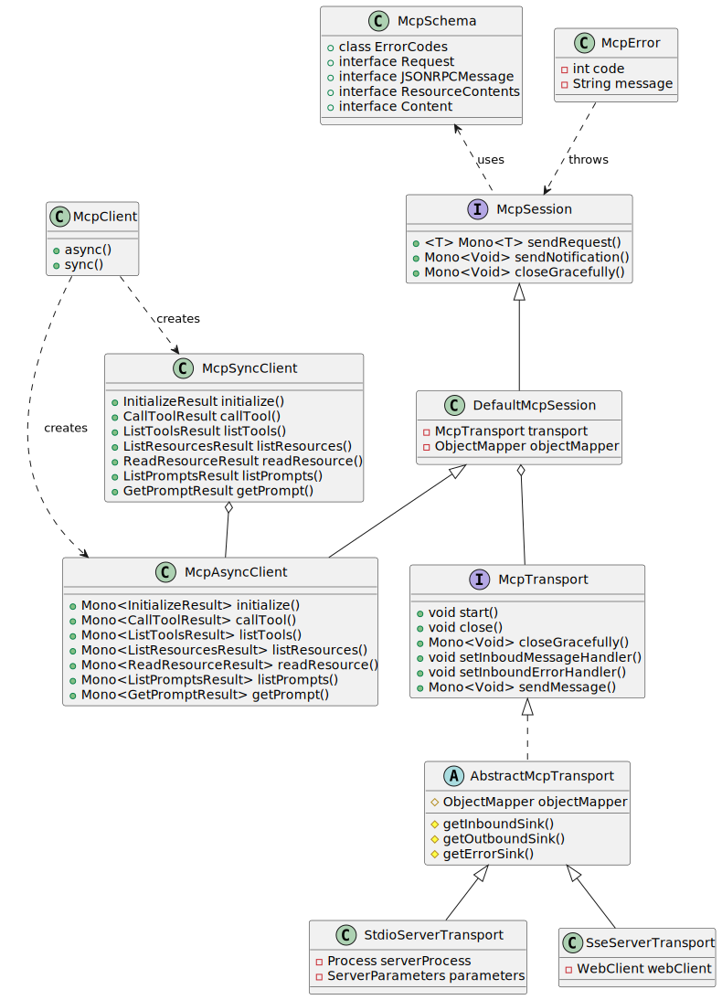

# Model Context Protocol (MCP) Java SDK

A Java implementation of the [Model Context Protocol](https://modelcontextprotocol.org/docs/concepts/architecture) specification, providing both synchronous and asynchronous clients for MCP server interactions.

## Overview

This SDK implements the Model Context Protocol, enabling seamless integration with AI models and tools through a standardized interface. It supports both synchronous and asynchronous communication patterns, making it suitable for various use cases and integration scenarios.

## Features

- Synchronous and Asynchronous client implementations
- Standard MCP operations support:
  - Protocol version compatibility negotiation
  - Client-server capability exchange
  - Tool discovery and execution
  - Resource management with URI templates
  - Resource subscription system
  - Prompt handling and management
  - Server initialization and ping
- Multiple transport implementations:
  - Stdio-based transport for process-based communication
  - SSE-based transport for HTTP streaming
- Reactive programming support using Project Reactor
- Configurable request timeouts
- Customizable JSON serialization/deserialization

## Installation

Add the following dependency to your Maven project:

```xml
<dependency>
    <groupId>org.springframework.experimental</groupId>
    <artifactId>spring-ai-mcp-core</artifactId>
    <version>0.1.0</version>
</dependency>
```

## Documentation

Detailed UML class diagrams showing the relationships between components can be found in [docs/class-diagrams.puml](docs/class-diagrams.puml). The diagrams include:
- Core Components: Shows the main interfaces, classes, and their relationships
- Message Flow: Illustrates the message and resource type hierarchies

## Usage

### Transport Layer Options

The SDK provides two transport implementations:

#### StdioServerTransport
Standard I/O based transport for process-based communication with MCP servers:

```java
ServerParameters params = ServerParameters.builder("npx")
    .args("-y", "@modelcontextprotocol/server-everything", "dir")
    .build();
McpTransport transport = new StdioServerTransport(params);
```

#### SseServerTransport
Server-Sent Events (SSE) based transport following the MCP HTTP with SSE transport specification:

```java
WebClient.Builder webClientBuilder = WebClient.builder()
    .baseUrl("http://your-mcp-server");
McpTransport transport = new SseServerTransport(webClientBuilder);

// Or with custom ObjectMapper
ObjectMapper mapper = new ObjectMapper();
McpTransport transport = new SseServerTransport(webClientBuilder, mapper);
```

The SSE transport provides:
- Bidirectional communication over HTTP
- Automatic reconnection for transient failures
- Inbound message streaming via SSE
- Outbound message delivery via HTTP POST
- Graceful shutdown handling
- Configurable JSON serialization

### Sync Client Example

```java
// Create and initialize sync client
ServerParameters params = ServerParameters.builder("npx")
    .args("-y", "@modelcontextprotocol/server-everything", "dir")
    .build();

try (McpSyncClient client = McpClient.sync(new StdioServerTransport(params))) {
    // Initialize connection with protocol version and capabilities
    McpSchema.InitializeResult initResult = client.initialize();

    // List available tools
    McpSchema.ListToolsResult tools = client.listTools();

    // Execute a tool
    McpSchema.CallToolResult result = client.callTool(
        new McpSchema.CallToolRequest("echo", Map.of("message", "Hello!"))
    );

    // Resource management
    McpSchema.ListResourcesResult resources = client.listResources();
    McpSchema.ReadResourceResult resource = client.readResource(
        new McpSchema.ReadResourceRequest("resource-uri")
    );

    // List and retrieve prompts
    ListPromptsResult prompts = client.listPrompts();
    GetPromptResult prompt = client.getPrompt(
        new McpSchema.GetPromptRequest("prompt-id", Map.of())
    );
}
```

### Async Client Example with Custom Configuration

```java
// Create server parameters
ServerParameters params = ServerParameters.builder("npx")
    .args("-y", "@modelcontextprotocol/server-everything", "dir")
    .build();

// Initialize async client with custom timeout and object mapper
McpAsyncClient client = McpClient.async(
    new StdioServerTransport(params),
    Duration.ofSeconds(30),
    new ObjectMapper()
);

// Initialize connection and chain operations
var result = client.initialize()
    .flatMap(initResult -> {
        // Connection initialized with protocol version compatibility
        return client.listTools();
    })
    .flatMap(tools -> {
        // Process available tools
        return client.callTool(new McpSchema.CallToolRequest("echo",
            Map.of("message", "Hello MCP!")));
    })
    .flatMap(toolResult -> {
        // Handle tool execution result
        return client.listPrompts();
    })
    .flatMap(prompts -> {
        // Process available prompts
        return client.getPrompt(new McpSchema.GetPromptRequest("prompt-id", Map.of()));
    });

// Subscribe to resource changes
var subscription = client.listResources()
    .flatMap(resources -> {
        return client.subscribeResource(new McpSchema.SubscribeRequest("resource-uri"));
    });

// Handle results reactively or block if needed
McpSchema.GetPromptResult promptResult = result.block();
subscription.block();

// Cleanup
client.closeGracefully().block();
```

## Architecture

The SDK follows a layered architecture with clear separation of concerns:

### Core Components

- **McpClient**: Factory class for creating sync and async clients with optional custom configuration
- **McpAsyncClient**: Primary async implementation using Project Reactor for non-blocking operations
- **McpSyncClient**: Synchronous wrapper around the async client for blocking operations
- **McpSession**: Core session interface defining communication patterns
- **McpTransport**: Transport layer interface for server communication
- **McpSchema**: Comprehensive protocol schema definitions
- **DefaultMcpSession**: Base implementation of the session management
- **StdioServerTransport**: Standard I/O based server communication
- **SseServerTransport**: HTTP-based transport using Server-Sent Events for bidirectional communication



### Key Interactions

1. Client Initialization
   - Transport setup and connection establishment
   - Protocol version compatibility check
   - Capability negotiation
   - Implementation details exchange

2. Message Flow
   - JSON-RPC message creation and validation
   - Transport layer handling
   - Response processing with type safety
   - Error handling with specific error codes

3. Resource Management
   - Resource discovery and listing
   - URI template-based resource access
   - Subscription system for change notifications
   - Resource content retrieval

4. Prompt System
   - Prompt discovery and listing
   - Parameter-based prompt retrieval
   - Change notifications support
   - Prompt content management

5. Tool Execution
   - Tool discovery and capability checking
   - Parameter validation and processing
   - Execution handling with timeout support
   - Result processing with error handling

## Error Handling

The SDK provides comprehensive error handling through the McpError class:

- Protocol version incompatibility
- Transport-level communication errors
- JSON-RPC protocol violations
- Tool execution failures
- Resource access and subscription errors
- Prompt management errors
- Request timeout handling
- Server capability mismatches
- SSE connection failures and retry handling
- HTTP request/response errors

## Contributing

Contributions are welcome! Please feel free to submit a Pull Request.

## License

Copyright 2024 - 2024 the original author or authors.

Licensed under the Apache License, Version 2.0 (the "License");
you may not use this file except in compliance with the License.
You may obtain a copy of the License at

https://www.apache.org/licenses/LICENSE-2.0

Unless required by applicable law or agreed to in writing, software
distributed under the License is distributed on an "AS IS" BASIS,
WITHOUT WARRANTIES OR CONDITIONS OF ANY KIND, either express or implied.
See the License for the specific language governing permissions and
limitations under the License.
